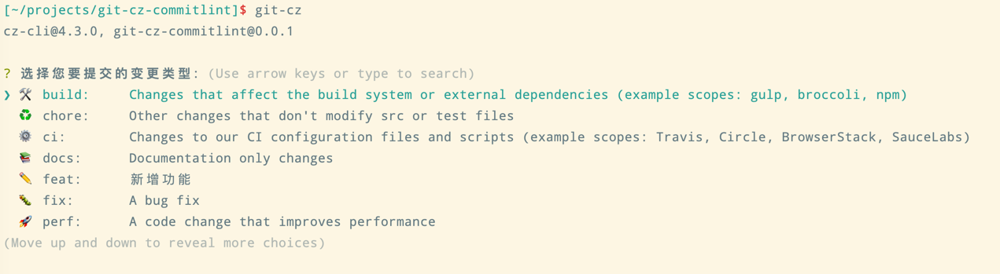

# git-cz-commitlint

Adapter for [commitizen](http://commitizen.github.io/cz-cli/) and author commit messages that adhere to the commit convention configured in `commitlint.config.js`.

## [Install commitlint](https://commitlint.js.org/#/guides-local-setup)

## Install peer Dependencies

```
$ npm install commitizen inquirer@8 --save-dev
```

## Config commitizen in `package.json`
```json
{
  "config": {
    "commitizen": {
      "path": "git-cz-commitlint"
    }
  }
}
```

## Install

```
$ npm install git-cz-commitlint --save-dev
```

or

```
$ yarn add git-cz-commitlint -D
```

or

```
$ pnpm add git-cz-commitlint -D
```

## Custom config

You can provide a custom configuration in a `commitlint` config file like `commitlint.config.js`.

```js
module.exports = {
  // original commitlint config
  extends: ['@commitlint/config-conventional'],

  // extra config
  format: '{type}{scope}: {emoji}{subject}', // => 'fix(scope): 🐛 fix xxx'
  // config type list to select
  types: ['build', 'chore', 'ci', 'docs', 'feat', 'fix', 'perf', 'refactor', 'revert', 'style', 'test'],
  // config scopes to select
  scopes: [],
  // enable emoji
  useEmoji: true,
  // type emoji
  emojis: {
    feat: '✏️',
    style: '🪄',
    revert: '👈',
    fix: '🐛',
    docs: '📚',
    refactor: '📦',
    perf: '🚀',
    test: '🚨',
    build: '🛠',
    ci: '⚙️',
    chore: '♻️',
  },
  // if rule can skip
  skips: ['scope'],
  // custom question description
  questionDescriptions: {
    type: '选择您要提交的变更类型',
  },
  // custom type enum description
  typeEnumDescriptions: {
    feat: '新增功能',
  },
};
```



